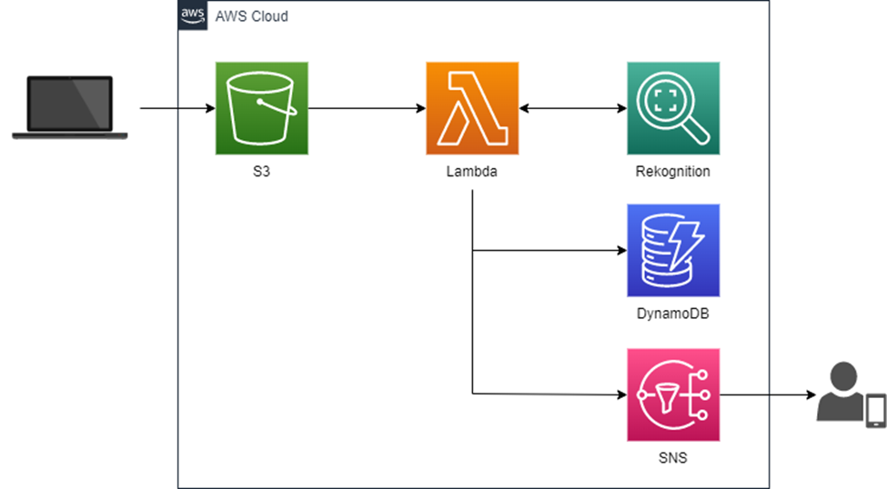

source:https://tutorialsdojo.com/5-best-cloud-projects-for-beginners/
# Services:

- Amazon S3
- AWS Lambda
- Amazon Rekognition
- Amazon DynamoDB
- Amazon SNS

---

# Architecture Workflow

## ✳️ Image Upload (S3)

+ A user uploads an image from their computer into an Amazon S3 bucket.

+ The bucket is configured with event notifications so that whenever a new image is uploaded, it automatically triggers the AWS Lambda function.

### 💰 pricing
---

## Processing (Lambda + Rekognition)

+ Lambda function is invoked when the new object (image) is created in S3.

+ Inside the Lambda function, you call Amazon Rekognition.

+ Rekognition analyzes the uploaded image and checks whether it contains faces.

---

## Decision Making

+ If no face is detected → nothing happens (or you can log it).

+ If a face is detected:

 + The Lambda function writes the metadata (image name, S3 path, number of faces, confidence score, etc.) into a DynamoDB table.
 + The Lambda function also triggers Amazon SNS (Simple Notification Service) to send an email notification (or SMS/push, depending on configuration).

---

## Notification

+ SNS publishes the message to all subscribers.

For example, if you configured email, the subscriber receives an email saying something like:

"A face has been detected in the uploaded image: [filename]."