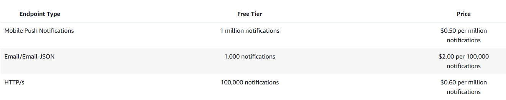

This project implements a facial recognition pipeline for a building's security system. It analyzes images captured by a front-door camera, processing up to 500 employee scans daily. Using Amazon Rekognition, the system detects faces in images uploaded to S3. If a face is recognized, the results are stored in DynamoDB, and a notification is sent via SNS to authorize security to unlock the door, allowing employees to enter the building and begin work.
 
 ---


source:https://tutorialsdojo.com/5-best-cloud-projects-for-beginners/

---

# Services:

- Amazon S3
- AWS Lambda
- Amazon Rekognition
- Amazon DynamoDB
- Amazon SNS

# zone 

US East (N.Virginia)

---

# Architecture Workflow

## ✳️ Image Upload (S3)

+ A user uploads an image from their computer into an Amazon S3 bucket.

+ The bucket is configured with event notifications so that whenever a new image is uploaded, it automatically triggers the AWS Lambda function.

### 💰 *S3 pricing*
S3 Standard - General purpose storage for any type of data, typically used for frequently accessed data	
First 50 TB / Month	$0.023 per GB

##### Requests & data retrievals 
- PUT, COPY, POST, LIST requests $0.005/per 1,000 requests
- GET, SELECT, and all other request $0.0004/per 1,000 requests
###### TOTAL
- 1️⃣ S3 Storage

15,000 images × 0.5 MB = 7,500 MB = 7.5 GB stored per month.
Pricing (S3 Standard): $0.023 per GB
Cost: 7.5 × $0.023 = $0.1725 ≈ $0.18 per month

- 2️⃣ S3 Requests

PUT (uploads) = 15,000 / 1,000 × $0.005 = $0.075
GET (retrieval by Rekognition) = 15,000 / 1,000 × $0.0004 = $0.006
Total = $0.081 ≈ $0.08 per month

---

## 🧮 Processing (Lambda + Rekognition)

+ Lambda function is invoked when the new object (image) is created in S3.

```hcl
const AWS = require("aws-sdk");

// Initialize AWS clients
const rekognition = new AWS.Rekognition();
const dynamoDB = new AWS.DynamoDB.DocumentClient();

exports.handler = async (event) => {
    try {
        // 1️⃣ Get S3 info from event (triggered when file uploaded to S3)
        const bucket = event.Records[0].s3.bucket.name;
        const key = decodeURIComponent(event.Records[0].s3.object.key.replace(/\+/g, " "));

        console.log(`New image uploaded: ${bucket}/${key}`);

        // 2️⃣ Call Rekognition to analyze the image
        const rekogParams = {
            Image: {
                S3Object: {
                    Bucket: bucket,
                    Name: key
                }
            },
            Attributes: ["ALL"]  // detect emotions, age, gender, etc.
        };

        const rekogResult = await rekognition.detectFaces(rekogParams).promise();

        console.log("Rekognition result:", JSON.stringify(rekogResult, null, 2));

        // 3️⃣ Extract some useful data (example: face count + top emotion)
        const faceDetails = rekogResult.FaceDetails || [];
        const faceCount = faceDetails.length;
        let topEmotion = "NONE";

        if (faceCount > 0 && faceDetails[0].Emotions.length > 0) {
            // Pick the most confident emotion
            topEmotion = faceDetails[0].Emotions.reduce((prev, curr) =>
                prev.Confidence > curr.Confidence ? prev : curr
            ).Type;
        }

        // 4️⃣ Save results to DynamoDB
        const dbParams = {
            TableName: "ImageAnalysis",
            Item: {
                ImageId: `${bucket}/${key}`,
                Timestamp: new Date().toISOString(),
                FaceCount: faceCount,
                TopEmotion: topEmotion,
                RawData: rekogResult   // optional: store full JSON response
            }
        };

        await dynamoDB.put(dbParams).promise();
        console.log(`Saved analysis for ${key} to DynamoDB`);

        return { statusCode: 200, body: "Success" };

    } catch (err) {
        console.error("Error processing image:", err);
        throw err;
    }
};
```

### 💰 *lambda pricing*
 The Lambda free tier includes 1M free requests per month and 400,000 GB-seconds of compute time per month.

+ Inside the Lambda function, you call Amazon Rekognition.

+ Rekognition analyzes the uploaded image and checks whether it contains faces.

### 💰 *Rekognition pricing*
Group 1 AssociateFaces First 1 million images $0.001
- workload: 500/day × 30 days = 15,000 images/month.
- 15,000 × $0.001 = $15.00/month (ignoring any free-tier credits).

---

## Decision Making

+ If no face is detected → nothing happens (or you can log it).

+ If a face is detected:

 + The Lambda function writes the metadata (image name, S3 path, number of faces, confidence score, etc.) into a DynamoDB table.
 + The Lambda function also triggers Amazon SNS (Simple Notification Service) to send an email notification (or SMS/push, depending on configuration).
 
### 💰 *DynamoDB pricing* 
DynamoDB Standard table class > On-Demand Throughput Type
DynamoDB Monthly Cost Estimate
500 uploads/day × 30 days = 15,000 writes/month
- Writes = ~$0.02
- Reads = ~$0.003 (depends on usage)
- Storage = ~$0.004
- Total ≈ $0.03/month
---

## Notification

+ SNS publishes the message to all subscribers.

For example, if you configured email, the subscriber receives an email saying something like:

"A face has been detected in the uploaded image: [filename]."

### 💰 *sns pricing*
--- 

--- 
$2 per 100,000 emails → your 15,000/month is only $0.30/month.

# TOTAL PROJECT WILL COST AROUND $15.56 per month